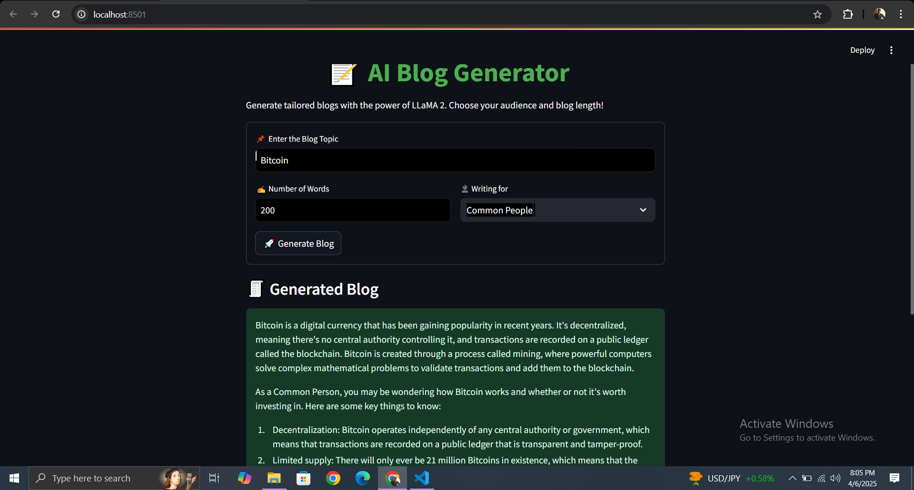

# 📝 AI Blog Generator using LLaMA 2 & Streamlit

This project is a simple yet powerful **Blog Generator** built with [Streamlit](https://streamlit.io/) and a locally hosted **LLaMA 2 model**. It allows users to generate tailored blog posts based on a topic, word count, and audience style.

---

## 🚀 Features

- Generate AI-powered blogs in seconds
- Choose your target audience: Researchers, Data Scientists, or Common People
- Customize the number of words
- Clean and responsive UI
- Built with `LangChain`, `CTransformers`, and `Streamlit`

---

## 🖼️ Demo Screenshot



> *(Add a screenshot of your app running here)*

---

## 🧠 Model Info

- **Model**: `llama-2-7b-chat.ggmlv3.q8_0.bin`
- **Model Type**: `llama`
- **Backend**: `CTransformers` for efficient local inference

---

## 🛠️ Installation & Setup

1. **Clone the repository**  
   ```bash
   git clone https://github.com/yourusername/llama2-blog-generator.git
   cd llama2-blog-generator

   ```
2. Create a Folder "models" and insert the LLM model you want to use. Huggingface would be a good platform for getting the desired models for free!
